# Architecture and choices

```mermaid
flowchart LR
  F[Component files] --> R[Discovery and contracts]
  R --> UI[Local designer]
  R --> C[Validated configuration]
  UI --> C
  C --> P[Portable plan]
  P --> B[New Batch Job / Slurm GPU preflight]
  B --> S[Flower ServerApp]
  S --> CL[ClientApp: train then submit]
  CL --> A[Defense pipeline and aggregation]
  A --> H[HDF5 trajectory / manifest / metrics]
  H --> V[Paired analysis and seed statistics]
```

- **Local web interface:** shared Python schema, no Node build or desktop package.
  Minimal install needs only NumPy and TOML writing; scientific dependencies are
  optional and imported at execution. The server binds loopback, with session
  tokens on writes, host/origin checks and path containment.
- **Flower is the distributed adapter:** client/server messages and actor
  resources remain Flower responsibilities. Attack/data/model logic is kept out
  of message callbacks. The pinned simulation launcher requires Slurm/CUDA;
  internal serial CPU fixtures are software checks only.
- **Standard TOML without Hydra:** a single explicit profile and component
  parameter schemas avoid environment-dependent overrides and configuration
  composition at launch. UI and CLI validate the same representation. This
  trades Hydra's composition features for transparent exported experiments.
- **One-file components:** discovery replaces implementation-name branches;
  protocol categories remain explicit. A component needs its metadata, parameter
  schema and hooks. Removal causes a clear unavailable-component error.
- **Two-phase rounds:** every client trains first, then submits its poisoned or
  clean update. Declared collusion/oracle attacks can use completed local states.
  Storage records original counts and raw/submitted deltas separately.
- **Parameter scope:** poisoning of updates is limited to named trainable
  parameters. Buffers retain local values; scalar counters can be persisted.
  This addresses the historical BatchNorm failure mechanism without claiming
  that an attack-specific numerical failure is valid attack efficacy.
- **Reproducibility:** logical-client seeds, deterministic Torch settings,
  dataset/source/runtime fingerprints, initial-state checks and pre-attack exact
  trajectory checks. Floating-point determinism across hardware is not assumed:
  mismatched environments are rejected for these paired comparisons.
- **Analysis:** paired macro-F1/recall/distance curves and final test metrics;
  positive F1-gap area uses trapezoidal integration. Bootstrap units are seeds,
  with duplicate seeds rejected and no statistical inference from rounds.

## Boundaries still requiring cluster verification

Slurm GPU configuration, driver/CUDA compatibility, Ray actor execution and
memory/concurrency tuning require a real allocated pilot. The dataset adapter
expects the existing 60-feature, five-class prepared parquet representation and
persisted IID or Dirichlet alpha=0.5 shards. It does not synthesize partitions.
CNN/transformer migration, multiattack groups and alpha=0.1 are future work.
No dataset or previous scientific result ships with the repository.
